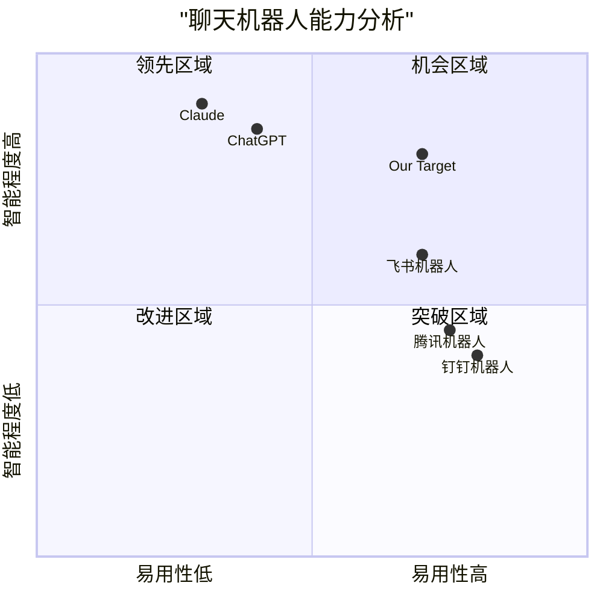
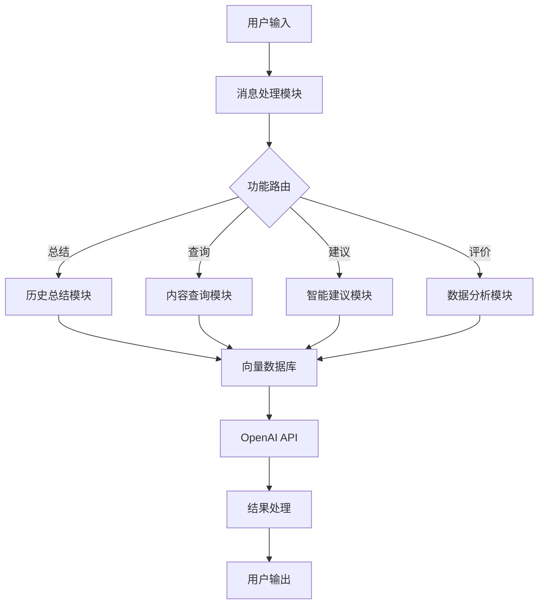

# 聊天机器人功能增强 PRD

## 1. 项目信息
- 项目名称: chat_bot_enhancement
- 编程语言: Python
- 原有系统组件:
  * main.py: 主程序，负责消息监控和处理
  * query_db.py: 向量数据库操作
  * embedding.py: 文本向量化
  * ai_handler.py: AI消息处理

## 2. 产品定义

### 2.1 产品目标
1. 提升用户体验：通过智能化功能让用户更便捷地获取和理解历史信息
2. 增强对话效率：提供更多实用工具来辅助用户交互和信息获取
3. 优化数据价值：充分利用历史数据提供深度分析和洞察

### 2.2 用户故事
1. 作为群组用户，我想快速了解错过的历史讨论内容，以便迅速跟上话题
2. 作为管理员，我想了解群组的整体讨论质量和活跃度，以便更好地管理群组
3. 作为普通用户，我想得到更智能的问题解答建议，以提高讨论效率
4. 作为活跃用户，我想方便地查找以前讨论过的相关内容，避免重复讨论

### 2.3 竞品分析

#### 主要竞品
1. Claude
- 优势：强大的总结能力，上下文理解准确
- 劣势：响应速度较慢，价格较高

2. ChatGPT
- 优势：通用能力强，有丰富的插件生态
- 劣势：无法进行历史消息存储和检索

3. 飞书机器人
- 优势：企业级功能完善，系统集成度高
- 劣势：通用性不足，定制化程度低

4. 钉钉机器人
- 优势：工作流集成好，操作简单
- 劣势：AI能力有限，功能相对单一

5. 腾讯机器人
- 优势：社交平台集成度高，用户基数大
- 劣势：自定义能力有限，扩展性不足

### 2.4 竞品象限图


## 3. 技术规格

### 3.1 需求分析

#### 3.1.1 历史内容总结功能
- 支持按时间范围总结对话内容
- 支持按主题/关键词提取相关讨论
- 支持多级总结（详细版/精简版）
- 支持定期自动总结推送

#### 3.1.2 内容查询辅助功能
- 支持语义化搜索
- 支持多维度过滤（时间、用户、话题等）
- 支持相似内容推荐
- 支持关联内容展示

#### 3.1.3 问题建议功能
- 基于历史数据的问题解答
- 智能推荐相关问题
- 提供解决方案建议
- 支持追问和澄清

#### 3.1.4 数据评价功能
- 讨论质量评估
- 活跃度分析
- 话题热度分析
- 用户参与度分析

### 3.2 需求池

#### P0级需求（必须实现）
1. 基础总结功能
   - 支持按时间范围总结对话
   - 提取关键信息点
   - 生成结构化摘要

2. 基础查询功能
   - 关键词搜索
   - 时间范围筛选
   - 用户筛选

3. 基础问答功能
   - 基于历史数据的问题匹配
   - 相似问题推荐
   - 简单的解答生成

#### P1级需求（重要）
1. 高级总结功能
   - 多维度总结（按主题/用户等）
   - 定制化总结模板
   - 自动摘要推送

2. 高级查询功能
   - 语义化搜索
   - 相关性排序
   - 多条件组合查询

3. 智能建议功能
   - 智能问题理解
   - 解决方案推荐
   - 交互式追问

#### P2级需求（待定）
1. 数据分析功能
   - 话题趋势分析
   - 用户画像分析
   - 互动模式分析

2. 可视化功能
   - 数据报表展示
   - 趋势图表生成
   - 互动关系图谱

### 3.3 系统架构设计



### 3.4 UI交互草图

```
@机器人 {命令} {参数}

示例：
@机器人 总结 今天
> 为您总结今天的讨论要点：
> 1. xxx
> 2. xxx
> ...

@机器人 查询 关键词
> 找到以下相关内容：
> 1. [时间] xxx
> 2. [时间] xxx
> ...

@机器人 建议 问题描述
> 建议方案：
> 1. xxx
> 2. xxx
> 相关问题：xxx
```

## 4. 开放问题

1. 性能优化
   - 如何优化大量历史消息的处理速度？
   - 如何降低API调用成本？

2. 准确性提升
   - 如何提高总结的准确性和相关性？
   - 如何优化语义搜索的匹配度？

3. 用户体验
   - 如何设计更直观的交互方式？
   - 如何处理复杂的多轮对话？

4. 系统稳定性
   - 如何处理API调用失败的情况？
   - 如何确保系统7*24小时稳定运行？

## 5. 后续规划

### 5.1 迭代计划
1. v1.0 - 基础功能实现（P0级需求）
2. v1.1 - 功能完善和优化（P1级需求）
3. v1.2 - 高级特性开发（P2级需求）

### 5.2 评估指标
1. 功能性指标
   - 总结准确率 > 90%
   - 查询相关性 > 85%
   - 建议采纳率 > 70%

2. 性能指标
   - 响应时间 < 2秒
   - 系统可用性 > 99.9%
   - API成功率 > 99%

3. 用户体验指标
   - 用户满意度 > 4.5/5
   - 功能使用频率提升 30%
   - 活跃用户增长 20%
